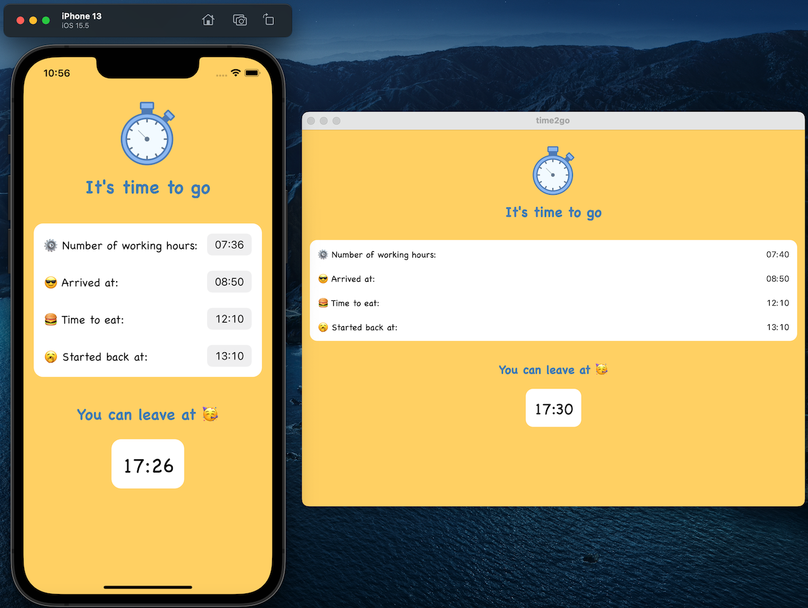

# Time 2 Go

## TL.DR

An IOS / Mac OS app to calculate when it's time to go home after a good day of work. 🤓

## Caution

This app is educational and was done to learn Swiftui. Don't take the context too seriously!

## Why ?

As an intern, you might need to finish work at a specific time and record the departure using a badge reader to avoid getting a rap on the knuckles from HR. 

## What ?

Time2go helps compute the time of departure given your time of arrival, the in and out times for lunch. You can also set up the amount of time you need to work by day and you can set up a local notification that reminds when it's time to go!

## How ?

By doing this app, I tried to implement little features step by step to understand basic concepts in Swift and Swiftui. To be honest, computing hours and minutes in Swift is not so easy due to the time zone.

### Features

- [X] Single vue
- [X] Persistency of the parameters
- [X] IOS and Mac OS
- [X] Local notification reminder
- [X] Dark mode
